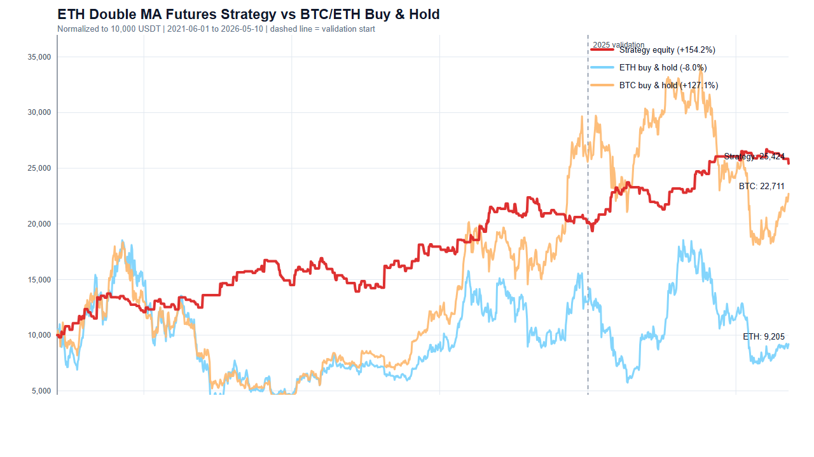
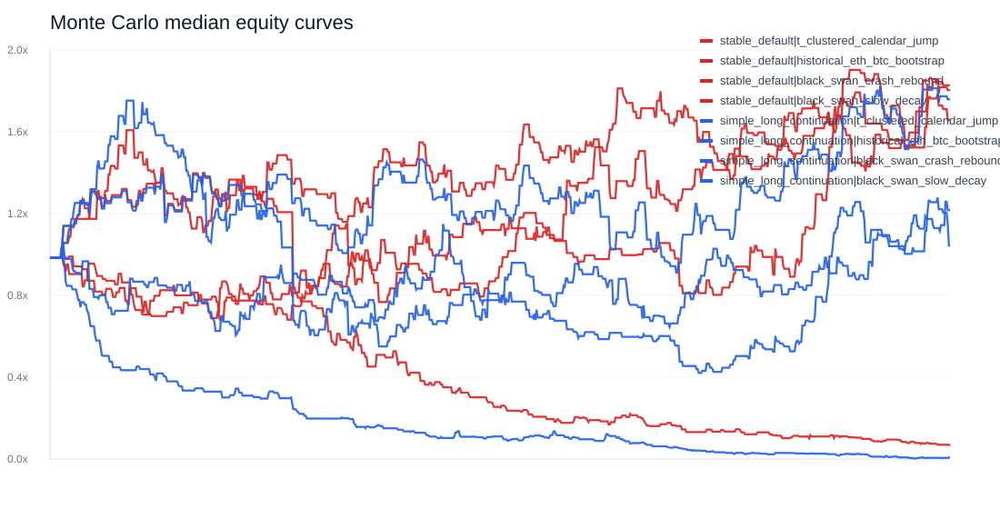

# 2026 Double MA Futures Strategy

ETH-only Freqtrade futures strategy based on a double moving-average compression breakout system.

This repository is for research and backtesting only. It is not investment advice and is not a live-trading guarantee.

## Strategy Summary

- Pair: `ETH/USDT:USDT`
- Main timeframe: `1h`
- Higher timeframe filter: `4h`
- Direction: long and short
- Exposure: effective `2x`
- Max open trades: `1`
- Entry idea: 5/10/30 MA + EMA compression, breakout, then first pullback confirmation
- Stop idea: planned structure stop through `custom_stoploss`
- Take-profit idea: structure target, minimum `2.3R`, preferred `3.5R`
- Trailing: ordinary trades off; strong 4h trend only, starts after `+5%`

## Equity Curve

Red = strategy, light blue = ETH buy-and-hold, light orange = BTC buy-and-hold.



## Main Results

Backtest uses Binance USD-M futures 1h data with an OKX futures adapter config.

| Period | Trades | CAGR | Total Profit | Winrate | Profit Factor | Max DD | Avg Win | Avg Loss | Payoff |
|---|---:|---:|---:|---:|---:|---:|---:|---:|---:|
| 2021-05-11 to 2025-01-01 | 215 | 21.46% | 100.84% | 34.88% | 1.345 | 17.72% | 5.24% | 2.09% | 2.51 |
| 2025-01-01 to 2026-05-11 | 76 | 36.94% | 53.04% | 39.47% | 1.591 | 18.54% | 4.77% | 1.95% | 2.44 |
| 2021-05-11 to 2026-05-11 | 291 | 20.78% | 154.24% | 36.08% | 1.404 | 13.51% | 5.11% | 2.05% | 2.49 |

## Benchmark

Same period, normalized to `10,000 USDT`.

| Curve | Final Equity | Total Return | CAGR | Max DD |
|---|---:|---:|---:|---:|
| Strategy | 25,424.16 | 154.24% | 20.80% | -17.72% |
| ETH buy-and-hold | 9,204.63 | -7.95% | -1.66% | -81.38% |
| BTC buy-and-hold | 22,710.60 | 127.11% | 18.07% | -77.24% |

## Monte Carlo Stress Test

The stress test generates fat-tailed, volatility-clustered, calendar-seasonal, jump-risk, BTC/ETH bootstrap, and black-swan synthetic 1h paths.

Main takeaway: the simpler stable strategy is more robust than the optional trend-continuation variant in stress tests.



- Report: `reports/futures_backtests/MONTE_CARLO_STRESS_TEST.md`
- Script: `scripts/monte_carlo_stress_test.py`

## Key Files

- Strategy: `user_data/strategies/VideoDoubleMaFuturesStrategy.py`
- Config: `config/config_okx_futures_eth_only_binance_data.json`
- Backtest summary: `reports/futures_backtests/eth_2x_false_breakout_refinement_results.json`
- Full note: `reports/futures_backtests/ETH_2X_FALSE_BREAKOUT_REFINEMENT.md`

## Install

```powershell
conda create -n env_freqtrade python=3.12 -y
conda activate env_freqtrade
pip install freqtrade
```

Optional plotting/data dependencies:

```powershell
pip install pandas pyarrow
```

## Run Backtest

From this folder:

```powershell
freqtrade backtesting `
  --userdir user_data `
  -c config\config_okx_futures_eth_only_binance_data.json `
  --datadir user_data\data\binance `
  --strategy VideoDoubleMaFuturesStrategy `
  --timeframe 1h `
  --timerange 20210511-20260511 `
  --export trades `
  --cache none
```

## Notes

The current version improved the false-breakout problem by converting the planned structural stop into a real Freqtrade `custom_stoploss`. This reduced delayed `body_line_invalid` exits and raised realized payoff to about `2.5R`.
